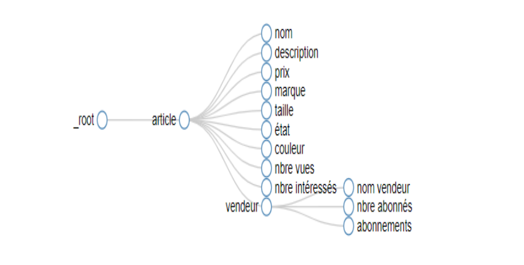
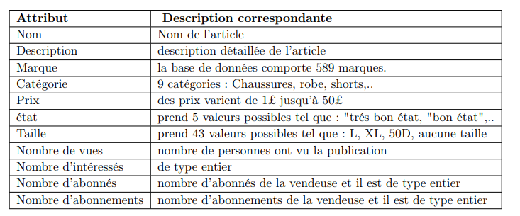
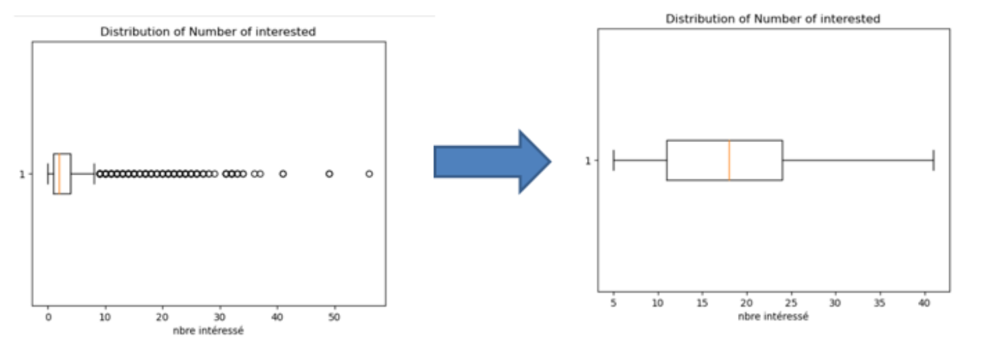
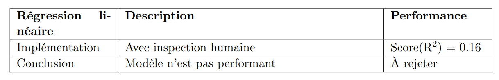
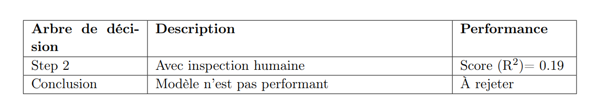
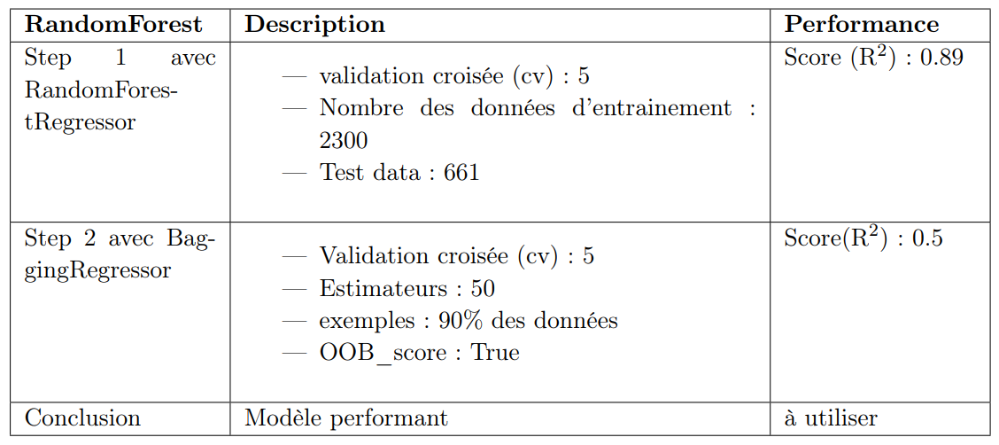
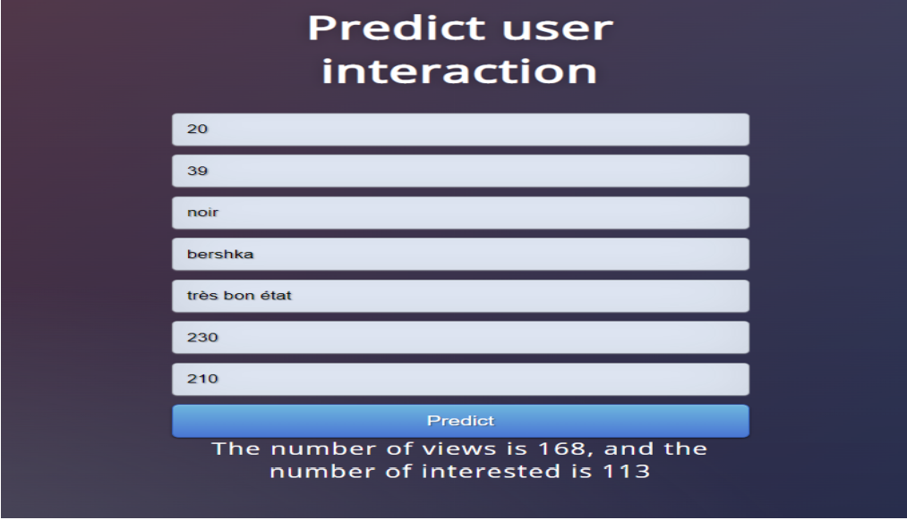

# Projet de Prédiction de l'interaction utilisateur 

### 1. Introduction 

Ce projet fixe pour objectifs, la prédiction de l’interaction utilisateur dans une plateforme
en ligne “VINTED” qui facilite l’achat et la vente de vêtements d’occasion. En effet, le problème posé est l’interaction limitée (nombre insuffisant de vues et d’intérêts) sur VINTED
pour quelques annonces. Notre premier but est d’aider les utilisateurs à augmenter les interactions avec leurs publications en fournissant un modèle d’apprentissage automatique qui peut
prédire le nombre de vues et d’intérêts qu’une publication est susceptible de recevoir. Cela leur
permettra de prendre des décisions éclairées pour optimiser leurs publications et augmenter
leurs chances d’attirer plus d’acheteur

### 2. Définition de Processus d'Extraction des données  
On a essayé d'experimenter avec deux méthodes: 
1. **Extraction avec l’extension Google WEB Scraper** 
   L’utilisateur doit définir des régles d’extraction de données tel que : le root qui est dans
notre cas l’article en précisant le domaine qui comporte le site exemple "vinted.fr", puis les
caractéristiques de cet article par exemple le nom, le prix, la description, la marque etc.., aussi
bien que des selecteurs CSS ou XPath et le type : texte ou Lien. Enfin, nous avons obtenu le
selecteur graphe ci-contre :
 
3. **Extraction des données avec Selenium** 
Le processus de l’extraction s’appuie sur l’importation des modules tels que Selenium, os
qui fournit des fonctions pour interagir avec le systéme d’exploitation aussi bien que la classe
webdriver du module selenium. Nous avons utilisé les méthodes "find_element‘_by_id(element_id)",
find_element_by_xpath(//div[class="example"])" pour extraire des informations liées aux
articles en se basant consécutivement sur l’id de l’élément et le xpath en cherchant par exemple
tous les éléments div ayant comme classe la valeur "example". Ensuite les données ont été stockées dans un Dataframe. Enfin, le Dataframe a été enregistré sous format excel.

4. **Comparaison des deux méthodes d'extraction**
En terme de rapidité, efficacité et complexité, selenium est plus rapide.

5. **Structure dataset**
La dataset est sous format excel comportant plus de 3000 exemples et les attributs sont : 

### 2. Préparation des données  

2.1. One Hot Encoding pour l'attribut catégorie et Label Encoder pour l'attribut taille, état, couleur.
2.2 Normalisation des données aprés le Label Encoder : avec la fonction Min-MaxScaler (représentation des données de moins en moins complexe)
2.3 Correction des valeurs aberrantes
2.4 Imputation des valeurs manquantes : Par exemple, dans la colonne "marque", on a remplacé les valeurs manquantes par "sans marque". Quant à la colonne "nombre d’intéressés", nous avons utilisé la méthode de la médiane.
2.5 Elimination des Outliers avec BoxPlot (Diagramme en boite) : 

### 3. Traitement des données 
Cette phase comporte des expérimentation avec plusieurs modéles tels que : la régression linéaire, l'arbre de décision et le random Forest et comporte aussi une analyse des résultats pour la justification du modéle retenu.
3.1 **Régression Linéaire**

3.2 **Arbre de décision**
la méthode de l’arbre de décision a été utilisé avec la méthode de la validation croisée
(cv)=5. En effet, ceci consiste à prendre 5 échantillons ou "fold", puis une boucle de validation
se fait 5 fois et à chaque fois, un fold est validé et les 4 fold seront entrainés par le modéle
d’apprentissage. Enfin, aprés chaque itération, une métrique de performance sera calculée.

3.3 **RandomForest**

### 4. Développement de l'interface 
La technologie utilisée est Flask, qui est un micro framework open-source de développement web en Python. Il est classé comme microframework car il est très léger. 
Le choix de Flask est justifié par sa simplicité, sa compatibilité avec le modéle en terme
de langage de développement qui est Python.

Le frontend est développé avec HTML/CSS/JS : 

